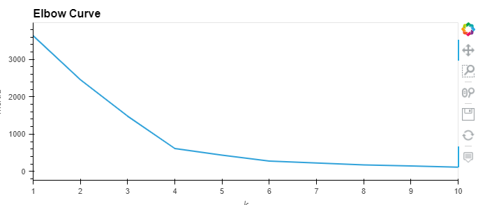
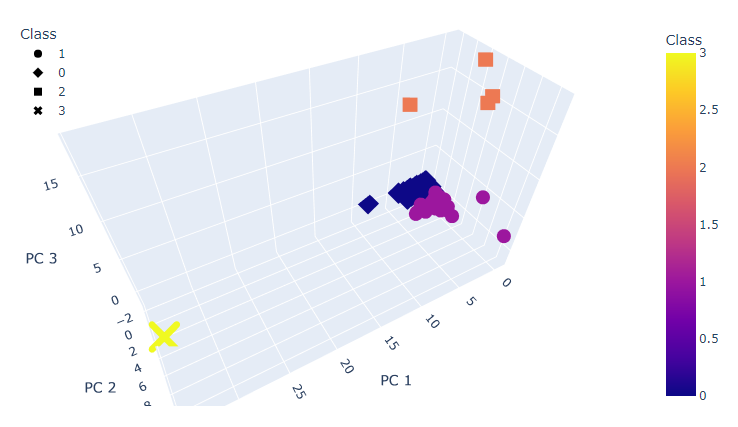
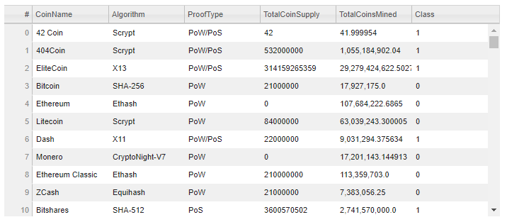
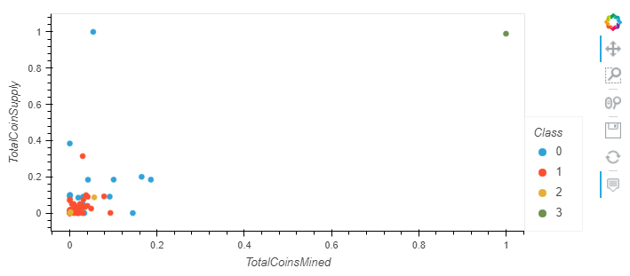

# Cryptocurrency Analysis

## Background

Accountability Accounting, a prominent investment bank, is interested in offering a new cryptocurrency investment portfolio for its customers. The company, however, is lost in the vast universe of cryptocurrencies. So, they’ve asked us to create a report that includes what cryptocurrencies are on the trading market and how they could be grouped to create a classification system for this new investment.

The data we have is not ideal, so it will need to be processed to fit the machine learning models. Since there is no known output for what we are looking for, we have decided to use unsupervised learning. To group the cryptocurrencies, we decided on a clustering algorithm. We will use data visualizations to share our findings with the board.

## Elbow Curve to Determine Best Value for K

## 3D-Scatter with PCA Data and Clusters

## Tradable Cryptocurrencies

## Scatter Plot of Tradable Cryptocurrencies

